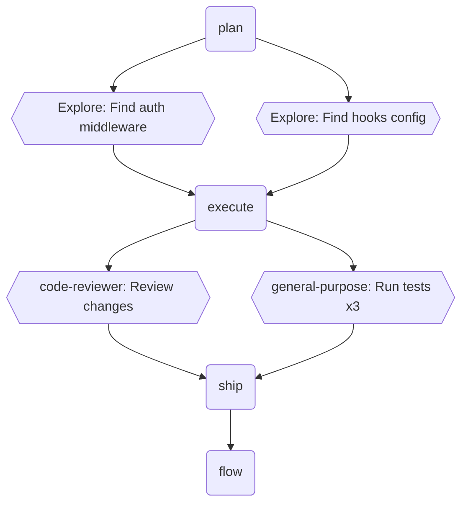

# Flow: Session Workflow Diagram

You are running the `/flow` skill. Generate a Mermaid diagram showing the development workflow trace for the current session.

## Steps

### 1. Find the trace file

The trace file is at `.claude/flow-trace-{CLAUDE_SESSION_ID}.jsonl` in the project root. The `CLAUDE_SESSION_ID` environment variable identifies the current session.

```bash
cat "${CLAUDE_PROJECT_DIR:-.}/.claude/flow-trace-${CLAUDE_SESSION_ID}.jsonl"
```

If the file is missing or empty, respond with:
> No trace data found for this session.

Then **STOP**. Do not output an empty diagram.

### 2. Parse JSONL entries

Each line is a JSON object with:
- `ts` — ISO timestamp (used for ordering and parallel detection)
- `type` — `"skill"` or `"agent"`
- `name` — skill name or agent subagent_type
- `description` — (agents only) task description
- `args` — (skills only) arguments passed

Sort entries by `ts` to determine ordering.

### 3. Build the Mermaid flowchart

Generate a `flowchart TD` with these rules:

**Node shapes:**
- Skill nodes: rounded rectangle — `S1(skill-name)`
  - If `args` is non-null, include it: `S1(skill-name: args)`
- Agent nodes: hexagon — `A1{{agent-type: description}}`
  - Truncate description to ~40 chars if longer

**Edges:**
- Sequential entries get `-->` edges connecting them in order
- **Parallel detection:** If two or more entries share the same predecessor AND their timestamps are within 1 second of each other, draw them as parallel edges from the predecessor (fan-out)
- **Collapse repeats:** If N consecutive entries have the same `type` AND `name`, collapse into a single node with a multiplier label, e.g. `A3{{general-purpose: Run tests x3}}`

**Node ID convention:**
- Skills: `S1`, `S2`, `S3`, ...
- Agents: `A1`, `A2`, `A3`, ...
- Number each type independently

### 4. Output

Output a fenced Mermaid code block:

````markdown

````

Keep the diagram clean and readable. If there are more than 20 nodes, summarize middle sections (e.g., collapse sequential agent dispatches more aggressively).
