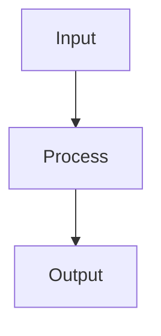

# PR Body Template

Shared template for PR creation across skills (`/ship`, `/execute`, parallel agents).

## Title Format

```
<type>(<scope>): <summary>
```

- `type`: feat, fix, chore, refactor, docs
- `scope`: backend, frontend, infra, tooling, etc.
- `summary`: under 70 characters

## Body Format

```markdown
## Summary
<1-5 bullet points describing what shipped — derived from CHANGELOG or commit history>

## How It Works
<Mermaid diagram showing the key flow introduced or changed>

Pick the diagram type that fits best:
- `sequenceDiagram` — request/response flows, multi-step pipelines, hook execution chains
- `flowchart TD` — decision trees, state machines, before/after architecture comparisons
- `erDiagram` — schema changes showing new tables/relationships

Keep diagrams focused — show the **new/changed flow only**, not the entire system.
5-15 nodes max. Skip for small PRs (< 50 lines, config-only, docs-only).

## Development Flow
<Mermaid flowchart TD diagram generated from the session's flow trace>

Auto-generated by the flow-trace hook which captures Skill and Agent invocations
during the session. Only include this section if `.claude/flow-trace-*.jsonl` exists
and is non-empty. If no trace data, skip this section entirely — no placeholder.

## Important Files
| File | Change |
|------|--------|
| `path/to/file.ts` | Added X handler with Y validation |
| `path/to/other.ts` | Updated Z to support new field |

Only include files with meaningful logic changes. Skip auto-generated files,
lock files, and trivial formatting changes. Group by layer:
schema → backend → API → frontend → infra → docs.
Max 10-12 rows — summarize remainder as "N additional files with minor changes".

## Test Results
| Suite | Result |
|-------|--------|
| Frontend unit | ✅ N passed |
| Backend unit | ✅ N passed |
| E2E | ✅ N passed |
| Lint | ✅ Clean |

Omit suites that weren't run (e.g., no backend changes = no backend tests).

## Pre-Landing Review
<findings summary, or "No issues found.">

## Doc Completeness
- [ ] CHANGELOG.md updated
- [ ] CLAUDE.md updated (if conventions/structure changed)
- [ ] tasks.md updated (if working on a spec)

🤖 Generated with [Claude Code](https://claude.com/claude-code)
```

## gh pr create Example

```bash
gh pr create --title "<type>(<scope>): <summary>" --body "$(cat <<'EOF'
## Summary
- Added X
- Fixed Y

## How It Works


## Important Files
| File | Change |
|------|--------|
| `src/foo.ts` | Added bar handler |

## Test Results
| Suite | Result |
|-------|--------|
| Frontend unit | ✅ 42 passed |
| Lint | ✅ Clean |

## Pre-Landing Review
No issues found.

## Doc Completeness
- [x] CHANGELOG.md updated

🤖 Generated with [Claude Code](https://claude.com/claude-code)
EOF
)"
```
